# 第一章	行列式与矩阵

## 行列式

### n阶矩阵

#### 找规律，解递推式

##### 找出矩阵的规律

**n 阶矩阵不对称时，找规律是一个难点。写下 2 阶矩阵与递增规律，来检验正确性。**

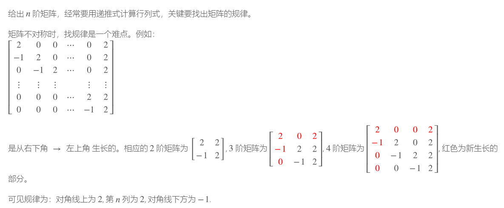

###### 例1：

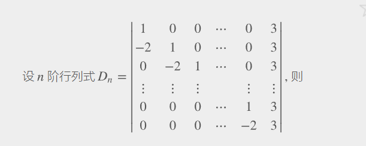

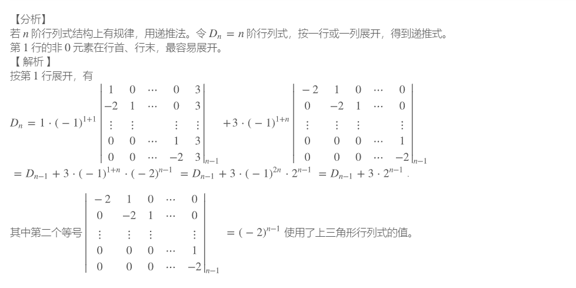

几阶递推式就是它需要前面几项来推出这一项

##### 二阶递推式的解

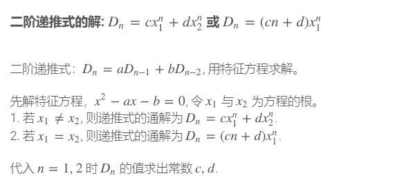

##### 一阶递推式的解

##### 综合题型

###### 例1：

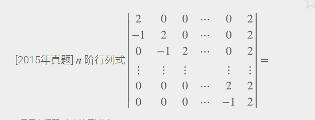

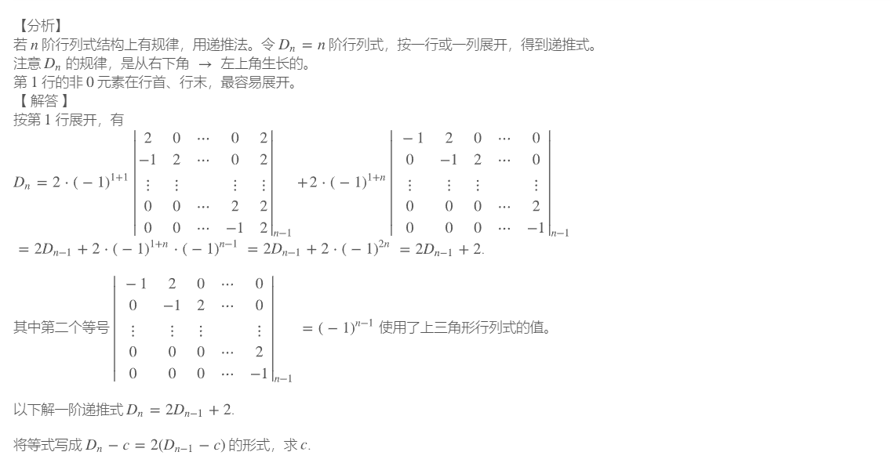

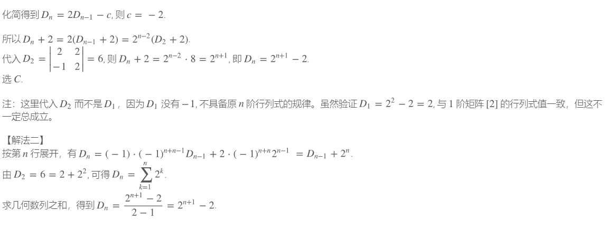

###### 例1：

###### 例2：

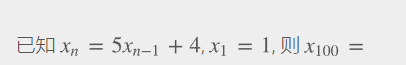

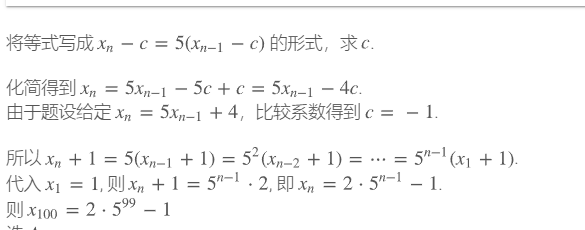

#### 4阶矩阵

##### 多0，直接展开

##### 没有0，创造0

##### 化简：三角化，拉普拉斯，范德蒙

#### 转置后的行列式值不变

#### 如果行列式某行(或列) 是两个元素之和，则可把行列式拆成两个行列式之和。

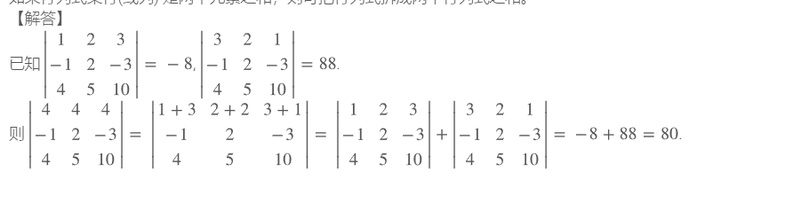

#### 行列式之间相乘相加不改变行列式的值，行列式之间互换位置，行列式的值变号

#### **行（列）相加得到** 1**:** **几行（列）相加后值相同, 提取公因子, 则这一行（列）都为 1**

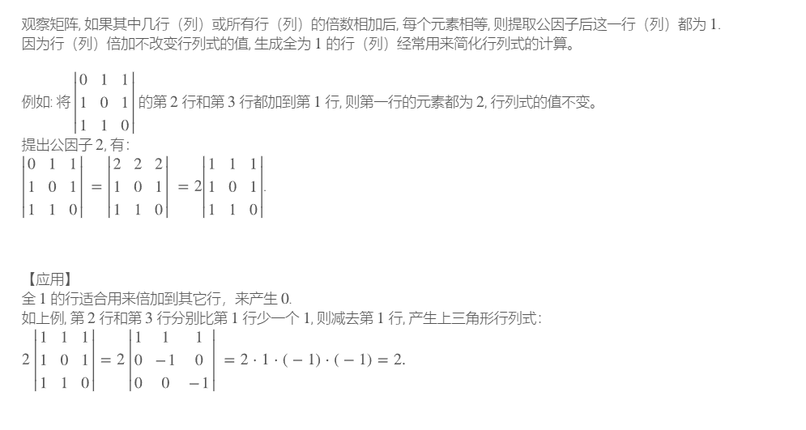

#### 范德蒙行列式

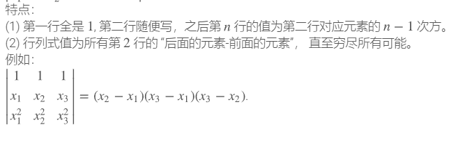

## 矩阵运算

### 矩阵变换

#### 行变换，列变换

#### 初等变换矩阵及逆矩阵

##### 初等矩阵及其逆矩阵

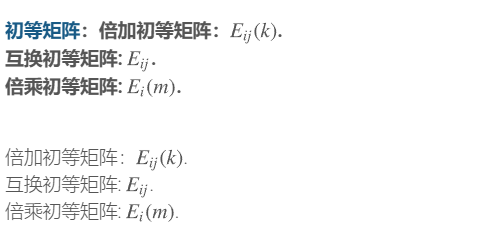

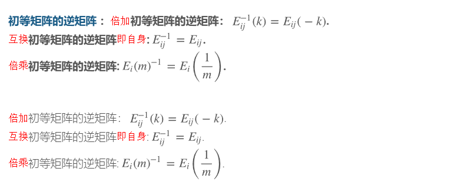

###### 例1：

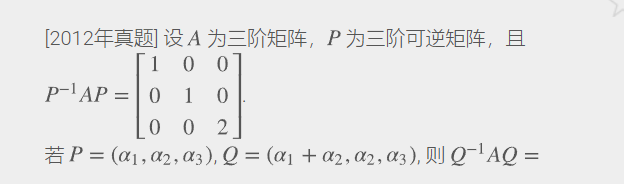

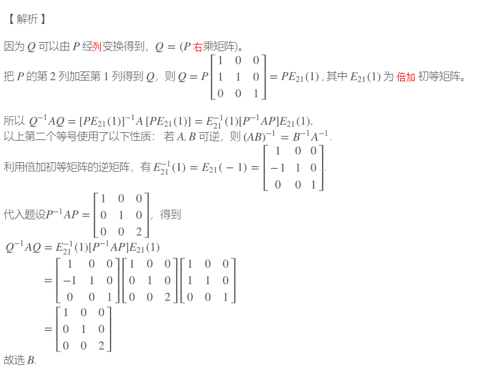

##### 例1：

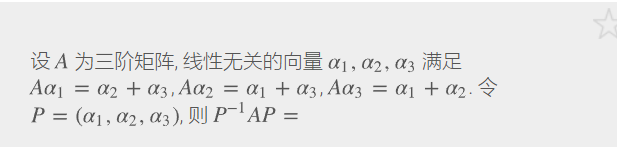

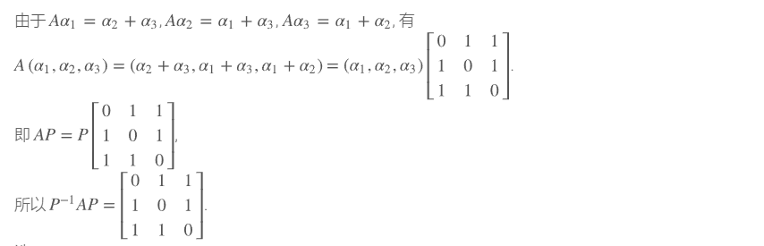

##### 可逆矩阵公式及定义

### 抽象矩阵

#### 结合律，分配率，高次幂

##### 矩阵乘法结合律

#### 灵活运用单位矩阵

##### 单位矩阵的性质：

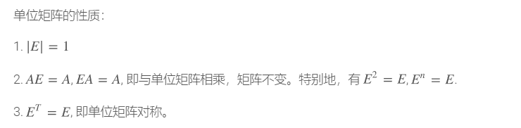

#### 解题技巧：等式两边同乘化简

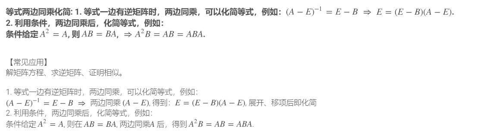

#### 运用$A^* = |A| A^{-1}$的恒等变换

##### 例1：

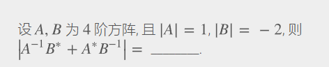

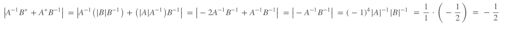

#### **计算和差的行列式、或逆矩阵:** **一个常用方法是作恒等变形，**

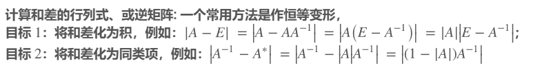

##### 例1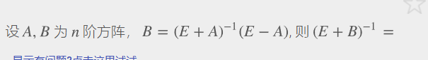

##### 例2：

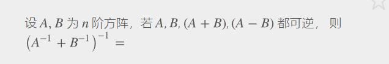

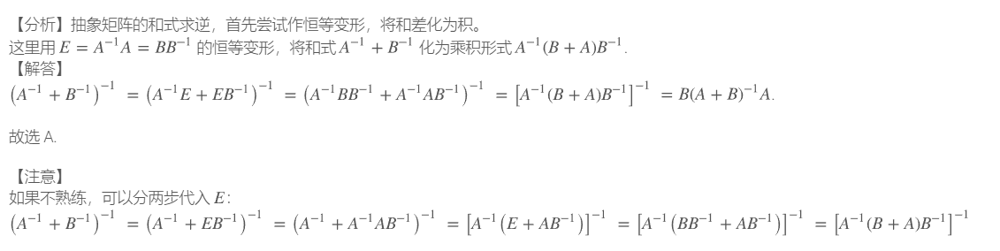

#### 用长除法求抽象矩阵

##### 例1：

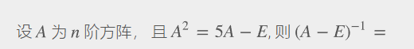

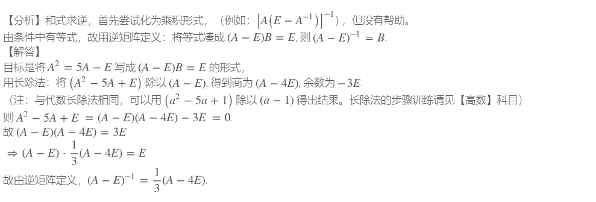

### 对角矩阵的n次方

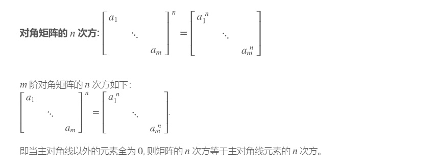

### $|kA| = k^{n}|A| \text{：若}A\text{是}n\text{阶矩阵，则}|kA| = k^{n}|A|$

### $\text{伴随矩阵的行列式:}|A^{*}| = |A|^{n - 1}$

### 求伴随矩阵*A*∗

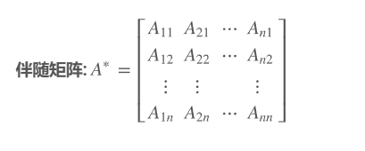

令 $A^* = (b_{ij})$，则 $b_{ij} = A_{ji}$

#### 例1：

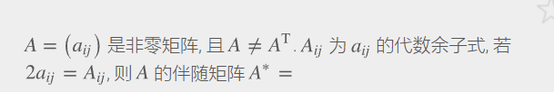

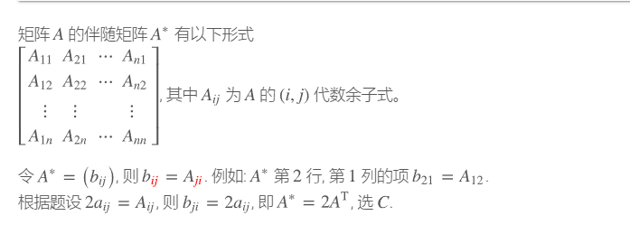

### 伴随阵与逆矩阵：

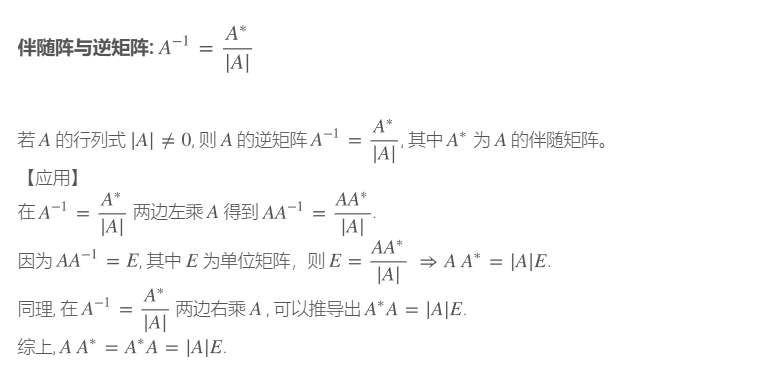

#### 伴随阵的行列互换位置，值要变号

### 反对称和对称矩阵

#### 反对称矩阵

对角线全为零，对称部分全为相反数

#### 对称矩阵

对称部分全相同，对角线无所谓

### 矩阵等价

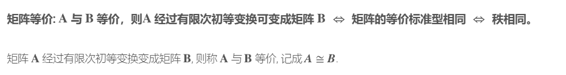

#### 等价标准形：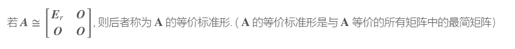

#### 判断矩阵等价的方法：

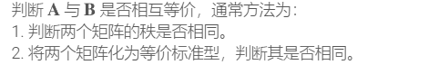

### **只包含** A,E **式的展开、分解:**

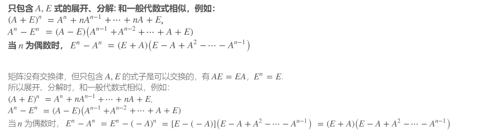

### 综合题型：

#### 例1

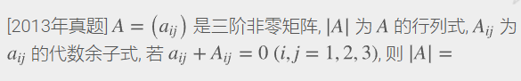

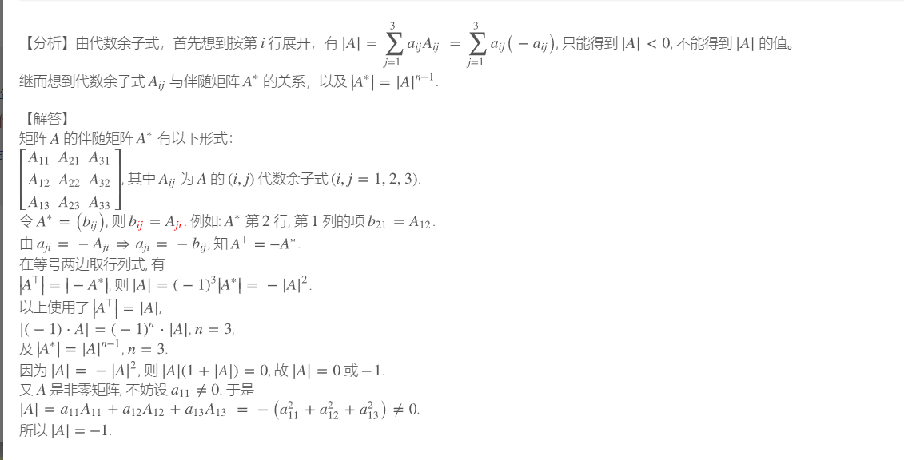