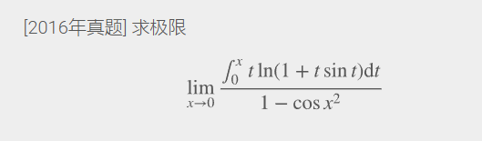
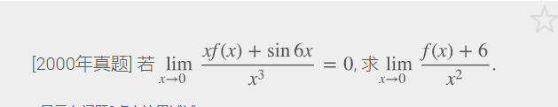

# 第一章	函数   极限  连续

## 第一节	函数

### 常见函数图像：

### 求反函数：

（1）若函数是 f(x)= 某式的形式，解出 x =？

（2）交换 x, y 的位置

若函数中有根式：先移项，使得等式一边仅保留一个根式；然后等式两边平方，消去根式。

#### 例 1：

### 求分段函数反函数：

（1）求反函数

（2）反函数的定义域，为原函数的值域

#### 例 1：

#### 例二：

对于无边界的函数要去求极限确定值域

### 求分段函数的复合函数

### 求f[g(x)]的表达式

**外层函数** f(x) **是分段函数:** **外层函数 f(x) 的定义域，对应于内层函数 g(x) 的值域，求每一段值域对应的 x 的范围**

设 f(x) 是分段函数，求复合函数 f[g(x)] 的表达式。
0 外层函数 f(x) 的定义域，对应于内层函数 g(x) 的值域
1 对内层函数的每一段值域，求出对应的 x 的范围
2 对每一段 x 的范围，求复合函数的表达式
3 写出复合函数完整的表达式

#### 例1：

### **将函数写成一个奇函数和一个偶函数之和:**

若函数 f(x) 的定义域关于原点对称，则 f(x) 可以写成一个奇函数和一个偶函数的和。

即 $$f(x) = \frac{f(x) - f(-x)}{2} + \frac{f(x) + f(-x)}{2}$$

### 判断函数单调性

#### 1.取特殊点

##### 例1：

## 第二节	极限

### 类型一极限：$\frac{0}{0}$, $\frac{\infty}{\infty}$, $0 \cdot \infty$

#### 例1：

#### （1）等价无穷小

#### （2）泰勒展开

#### （3）洛必达

ps: 优先级从 1 到 3

##### 使用洛必达法则前，必须检验三个条件：

##### 例一：

##### 例二：

##### 例3：

### 类型二极限：$\infty - \infty$

通分或乘除某式转化为类型一

### 类型三：

#### （1）$1^\infty$

运用  $\lim_{x \to 0} (1+x)^{\frac{1}{x}} = e$

##### 例1：

##### 例2：

##### 例3（倒代换）：

#### （2）$0^0, \infty^0$

写成指数函数形式，化为类型一

$u(x)^{v(x)} = e^{v(x) \ln u(x)}$

##### 例1：

##### 小技巧：

$x^{\frac{1}{x}} = e^{\frac{\ln x}{x}}$

### 指数函数和多项式的极限：$\lim_{x \to +\infty} e^{-\delta x} x^k = 0, \quad (\text{常数 } \delta > 0, k > 0)$

### $\lim_{x \to 0^+} x^\delta (\ln x)^k = 0, \quad (\text{常数 } \delta > 0, k > 0)$

### $\lim_{n \to \infty} \sqrt[n]{n} = 1$

#### 例1

### $\lim_{n \to \infty} \sqrt[n]{a} = 1$

#### 例1：

### 已知极限求另一相关的函数极限

化简已知极限，往往可得出相关函数极限。

#### 例1

### 变限积分求导公式

$\left(\int_{\varphi_1(x)}^{\varphi_2(x)} f(t) dt\right)' = f(\varphi_2(x))\varphi_2'(x) - f(\varphi_1(x))\varphi_1'(x)$

#### 例1

### 极限和差存在情况

（1）存在+存在=存在

（2）存在+不存在=不存在

（3）不存在+不存在=不确定

### 极限乘积存在情况

**除去两个极限都存在的情况，所有其它情况，乘积**不一定**存在**

### 复合函数的极限

f(x)可能在u0处无定义，所以要f[g(x)]存在的话,g(x)不能=u0

### 有理化

$\sqrt{f(x)} - \sqrt{g(x)} = \frac{f(x) - g(x)}{\sqrt{f(x)} + \sqrt{g(x)}}$
